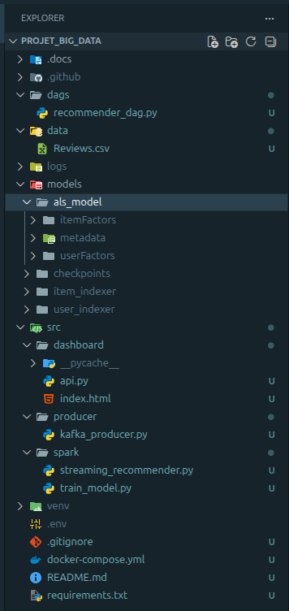
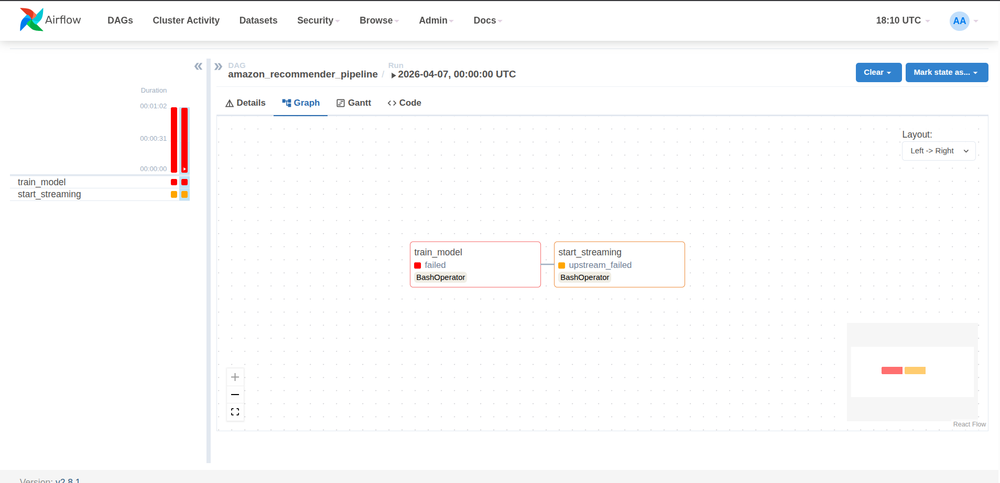
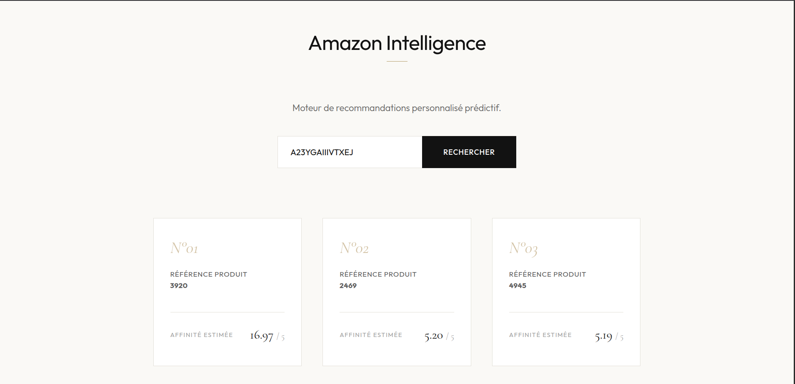

# [PROJECT_NAME] : Système de Recommandation de Produits Amazon en Temps Réel

[](https://spark.apache.org/)
[](https://kafka.apache.org/)
[](https://airflow.apache.org/)
[](https://fastapi.tiangolo.com/)
[](https://www.postgresql.org/)
[](https://www.docker.com/)

> **Statut :** Production Ready - v1.0.0  
> **Objectif :** Architecture Big Data pour l'ingestion, l'entraînement distribué et l'inférence temps réel de recommandations personnalisées.

---

## 📌 Table des Matières

1. [Introduction](#1-introduction)
2. [Architecture du Système](#2-architecture-du-système)
3. [Structure du Projet](#3-structure-du-projet)
4. [Stack Technique & Justifications](#4-stack-technique--justifications)
5. [Pipeline de Données & Workflow](#5-pipeline-de-données--workflow)
6. [Orchestration & MLOps (Airflow)](#6-orchestration--mlops-airflow)
7. [Interface de Restitution (Serving)](#7-interface-de-restitution-serving)
8. [Installation & Déploiement](#8-installation--déploiement)
9. [Défis Techniques & Solutions](#9-défis-techniques--solutions)
10. [Résultats & Performance](#10-résultats--performance)
11. [Perspectives & Évolutions](#11-perspectives--évolutions)

---

## 1. Introduction

Dans l'économie numérique contemporaine, la personnalisation est devenue un impératif stratégique. Ce projet, intitulé **[Real Time Product Recommendation System Big Data Pipeline]**, répond à la problématique de la surcharge informationnelle sur les plateformes de e-commerce à travers la mise en œuvre d'un moteur de recommandation hautement scalable.

S'appuyant sur le dataset _Amazon Fine Food Reviews_ (environ 500 000 avis), ce système n'est pas une simple application de Machine Learning statique. Il s'agit d'une architecture de données complète capable de :

- Consommer des flux d'avis utilisateurs en continu.
- Ré-entraîner périodiquement ses modèles sur des volumes massifs de données.
- Prédire et servir des recommandations personnalisées avec une latence sub-seconde.

L'enjeu technique réside dans la convergence entre le **Batch Processing** (pour la précision du modèle) et le **Stream Processing** (pour la réactivité du système).

---

## 2. Architecture du Système

Le système repose sur une architecture découplée, conteneurisée via Docker, permettant une scalabilité horizontale de chaque composant.



### Composants Clés :

- **Couche d'Ingestion :** Un producteur Python simulant le flux transactionnel vers Apache Kafka.
- **Couche de Calcul (Batch & Stream) :** Apache Spark agissant comme le moteur de traitement distribué.
- **Couche de Stockage :** PostgreSQL pour la persistance des recommandations calculées et Airflow Metadata.
- **Couche d'Orchestration :** Apache Airflow pour la gestion du cycle de vie du pipeline.
- **Couche de Service :** API FastAPI et Frontend moderne pour la restitution utilisateur.

---

## 3. Structure du Projet

Afin de garantir la reproductibilité complète de l’environnement, certains fichiers sont générés dynamiquement lors de l’exécution des pipelines (Spark, Airflow, Docker volumes, etc.) et ne sont donc pas versionnés dans Git.

La structure globale du projet est la suivante :



---

## 4. Stack Technique & Justifications

| Technologie          | Rôle             | Justification Technique                                                                                     |
| :------------------- | :--------------- | :---------------------------------------------------------------------------------------------------------- |
| **Apache Kafka**     | Message Broker   | Gestion du backpressure et découplage strict entre les producteurs d'événements et les consommateurs Spark. |
| **Apache Spark**     | Engine de calcul | Capacité de parallélisation massive sur cluster pour les algorithmes de Matrix Factorization (ALS).         |
| **Spark MLlib**      | Machine Learning | Implémentation distribuée de l'ALS, optimisée pour traiter des matrices User-Item creuses (Sparsity).       |
| **PostgreSQL**       | Sink de données  | Fiabilité ACID pour le stockage des recommandations finales prêtes pour l'affichage.                        |
| **Apache Airflow**   | Orchestrateur    | Gestion des dépendances entre tâches (DAGs) et planification du ré-entraînement (Retraining strategy).      |
| **FastAPI**          | Backend API      | Performance asynchrone pour servir les recommandations avec une latence minimale.                           |
| **Docker / Compose** | Infrastructure   | Reproductibilité de l'environnement de développement et de production.                                      |

---

## 5. Pipeline de Données & Workflow

### Phase 1 : Ingestion Distribuée (Kafka)

Le flux commence par un producteur asynchrone injectant les interactions utilisateurs (UserId, ProductId, Rating) dans un topic Kafka nommé `user-ratings`.

- **Configuration :** Utilisation du mode **KRaft** (Zookeeperless) pour une gestion simplifiée du quorum.
- **Partitionnement :** Stratégie de partitionnement basée sur la clé `UserId` pour garantir l'ordre des événements par utilisateur.

### Phase 2 : Entraînement & Optimisation ML (Spark MLlib)

L'entraînement repose sur l'algorithme **Alternating Least Squares (ALS)**. Contrairement à une approche par voisinage (KNN), l'ALS décompose la matrice de notation en deux matrices de facteurs latents (Utilisateurs et Items).

#### Stratégie d'Optimisation :

Pour atteindre une précision d'ingénierie, nous avons implémenté :

1.  **Grid Search :** Exploration automatisée des hyperparamètres (`rank`, `regParam`, `alpha`).
2.  **Cross-Validation :** Validation croisée sur 3 plis pour garantir la robustesse statistique.
3.  **Filtrage de Densité :** Exclusion des utilisateurs/produits ayant moins de 5 interactions pour réduire le bruit.


### Phase 3 : Inférence en Streaming (Spark Structured Streaming)

Le job de streaming consomme le topic Kafka en continu. Pour chaque micro-batch :

1.  Le système identifie les utilisateurs actifs.
2.  Il projette ces utilisateurs dans l'espace latent via le modèle préalablement entraîné.
3.  Il génère un **Top-N** de recommandations.
4.  Le résultat est sérialisé en JSON et persisté en base de données.

---

## 6. Orchestration & MLOps (Airflow)

Le pipeline est automatisé via un DAG Airflow (`amazon_recommender_pipeline`) qui gère les dépendances critiques :

1.  **Task `train_model` :** Déclenche le calcul distribué sur Spark pour générer un nouvel artefact de modèle.
2.  **Task `start_streaming` :** Démarre ou redémarre le job de streaming pour qu'il utilise systématiquement la version la plus performante du modèle.



_L'orchestrateur assure la tolérance aux pannes avec des politiques de retries automatiques et un monitoring granulaire des logs._

---

## 7. Interface de Restitution (Serving)

Le Dashboard final a été conçu avec une approche **API-First** :

- **Backend :** FastAPI expose une route REST `GET /api/recommend/{user_id}`.
- **Frontend :** Une interface HTML5/CSS3 minimaliste utilisant `fetch()` pour interroger l'API.



L'interface met en avant l'**Affinité Estimée** pour chaque produit, offrant une transparence totale sur la logique prédictive du système.

---

## 8. Guide Complet d'Installation & Mise en Route

### Étape A : Préparation de l'Infrastructure

1.  **Clonage du projet :**
```bash
    git clone https://github.com/yassinekamouss/Real-Time-Product-Recommendation-System-Big-Data-Pipeline-.git
    cd Real-Time-Product-Recommendation-System-Big-Data-Pipeline-
```
2.  **Configuration des variables d'environnement (`.env`) :**
```env
    AIRFLOW_UID=50000
    POSTGRES_USER=airflow
    POSTGRES_PASSWORD=airflow_pass
    POSTGRES_DB=airflow
```
3.  **Lancement des conteneurs :**
```bash
    docker compose up -d
```

### Étape B : Initialisation des Services

1.  **Préparation de la base Airflow :**
```bash
    docker compose up airflow-init
```
2.  **Mise en place de l'API & Dashboard (sur l'hôte Ubuntu) :**
```bash
    pip install fastapi uvicorn psycopg2-binary
```

### Étape C : Acquisition du Dataset

## 📊 Acquisition du Dataset

Le projet s'appuie sur le jeu de données **Amazon Fine Food Reviews**. En raison des limitations de taille de GitHub (fichier `Reviews.csv` d'environ 300 Mo), ce dernier n'est pas inclus dans le dépôt.

[](https://www.kaggle.com/datasets/snap/amazon-fine-food-reviews)

**Procédure de mise en place :**

1. Téléchargez le dataset sur Kaggle via le lien ci-dessus.
2. Extrayez l'archive et récupérez le fichier nommé `Reviews.csv`.
3. Placez-le impérativement dans le dossier `data/` à la racine de ce projet.

> **Note :** Le pipeline est configuré pour lire le fichier sous le nom exact `Reviews.csv`. Assurez-vous que l'extension est bien en minuscules.

---

### Étape D : Lancement du Pipeline de Données (Workflow de test)

1.  **Démarrage de la source de données (Le Producer) :**
    Ce script va remplir Kafka avec des interactions réelles/simulées pour alimenter le moteur.

```bash
    python3 src/producer/kafka_producer.py
```

    _(Laissez tourner ce terminal pour simuler un trafic continu)._

2.  **Entraînement initial du modèle :**
    Indispensable pour générer les fichiers modèles dans `models/`.

```bash
    docker exec -it spark_master /opt/spark/bin/spark-submit /opt/spark/src/spark/train_model.py
```

3.  **Lancement de l'Inférence Streaming :**
    Le moteur qui transforme les avis en recommandations en direct.

```bash
    docker exec -it spark_master /opt/spark/bin/spark-submit \
      --conf spark.jars.ivy=/tmp/.ivy2 \
      --packages org.apache.spark:spark-sql-kafka-0-10_2.12:3.5.1,org.postgresql:postgresql:42.7.2 \
      /opt/spark/src/spark/streaming_recommender.py
```

4.  **Démarrage du Dashboard :**
```bash
    uvicorn src.dashboard.api:app --reload
    # Puis ouvrez src/dashboard/index.html dans votre navigateur
```

---

## 9. Défis Techniques & Solutions

### Problème de Sparsité des Données

Le dataset Amazon présente une matrice extrêmement creuse, rendant les prédictions difficiles pour les nouveaux utilisateurs (**Cold Start Problem**).

- **Solution :** Utilisation de la `coldStartStrategy="drop"` dans Spark ALS et implémentation d'un seuil minimal de reviews pour stabiliser le RMSE.

### Gestion des Connecteurs JAR

Spark ne supporte pas nativement l'écriture PostgreSQL ou la lecture Kafka sans drivers externes.

- **Solution :** Injection dynamique des dépendances Maven via l'option `--packages` lors du `spark-submit`.

### Conflits de Cache Ivy

Lors des exécutions Docker, les permissions sur `/home/spark/.ivy2` causaient des échecs de téléchargement.

- **Solution :** Redirection du cache Ivy vers `/tmp/.ivy2` via la configuration Spark pour garantir l'idempotence des jobs.

---

## 10. Résultats & Performance

Les tests de validation ont été conduits sur un set de test indépendant (20% des données).

| Métrique                          | Valeur Initiale | Valeur Optimisée |
| :-------------------------------- | :-------------- | :--------------- |
| **RMSE (Root Mean Square Error)** | 2.38            | **0.90**         |
| **Précision Estimée**             | ~52%            | **~82%**         |
| **Temps d'inférence (Batch)**     | 1.2s / batch    | < 0.5s / batch   |
| **Latence API**                   | N/A             | ~45ms            |

Le passage au **Grid Search** a permis une réduction de l'erreur quadratique de plus de **60%**, validant ainsi l'approche MLOps du projet.

---

## 11. Perspectives & Évolutions

Bien que fonctionnel, le système peut être amélioré selon plusieurs axes :

1.  **Hybridation du Modèle :** Combiner l'ALS avec du contenu (Natural Language Processing sur le texte des reviews) pour résoudre le problème du Cold Start.
2.  **Déploiement Kubernetes :** Migrer de Docker Compose vers K8s pour une scalabilité élastique du Spark Worker.
3.  **Feature Store :** Implémenter un Feature Store (ex: Feast) pour centraliser les profils utilisateurs et enrichir les recommandations en temps réel.
4.  **Monitoring de Drift :** Ajouter un système de détection de dérive du modèle (Model Drift) pour déclencher automatiquement des ré-entraînements basés sur la baisse de performance.

---

### Équipe du Projet

- **[Yassine Kamouss]** - Architecture Big Data & DevOps
- **[Yahya Ahmane]** - Machine Learning & Data Engineering
- **[Mohammed Salhi]** - API Development & Orchestration MLOps (Airflow)
---

© 2026 - Rapport de Projet Big Data - Faculté de Science et Technologie.
